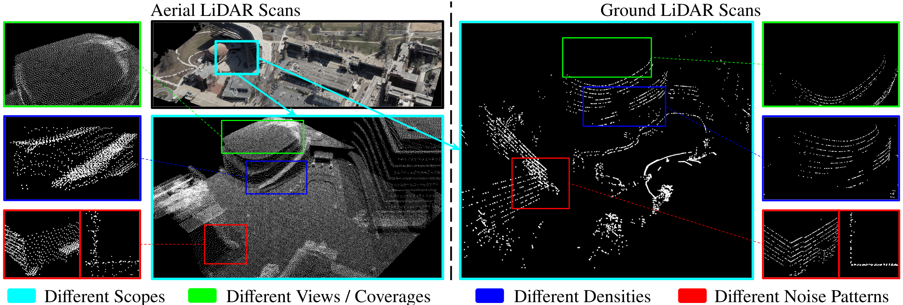
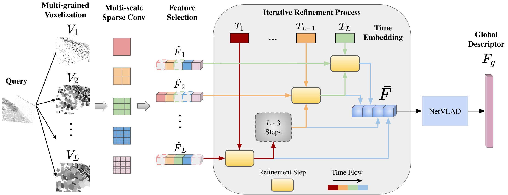

# CrossLoc3D: Aerial-Ground Cross-Source 3D Place Recognition (Accepted by ICCV 2023)

[](https://github.com/rayguan97/crossloc3d/stargazers)
[](https://github.com/rayguan97/crossloc3d/network)
[](https://github.com/rayguan97/crossloc3d/issues)
[](https://github.com/rayguan97/crossloc3d/blob/master/LICENSE) \
[](https://paperswithcode.com/sota/3d-place-recognition-on-oxford-robotcar?p=crossloc3d-aerial-ground-cross-source-3d)


[CrossLoc3D: Aerial-Ground Cross-Source 3D Place Recognition](https://arxiv.org/abs/2303.17778)
<br> Tianrui Guan, Aswath Muthuselvam, Montana Hoover, Xijun Wang, Jing Liang, Adarsh Jagan Sathyamoorthy, Damon Conover, Dinesh Manocha

# Motivation

<br>
Representation gap between aerial and ground sources: We use the bounding box with the same color to focus on the same region and highlight the differences between aerial (**left**) and ground (**right**) LiDAR scans. Scopes (  <span style="color:cyan">cyan</span>): The aerial scans cover a large region, while ground scans cover only a local area. Coverages (  <span style="color:lawngreen">green</span>): The aerial scans cover the top of the buildings, while ground scans cover more details on the ground. Densities (  <span style="color:blue">blue</span>): The distribution and density of the points are different because of various scan patterns, effective ranges, and fidelity of LiDARs. Noise Patterns (  <span style="color:red">red</span>): The aerial scans have larger noises, as we can see from a bird-eye view and top-down view of a corner of the building.
<br>

# Network Architecture

<br>
<br>

If you find this project useful in your research, please cite our work:

```latex
@InProceedings{Guan_2023_ICCV,
    author    = {Guan, Tianrui and Muthuselvam, Aswath and Hoover, Montana and Wang, Xijun and Liang, Jing and Sathyamoorthy, Adarsh Jagan and Conover, Damon and Manocha, Dinesh},
    title     = {CrossLoc3D: Aerial-Ground Cross-Source 3D Place Recognition},
    booktitle = {Proceedings of the IEEE/CVF International Conference on Computer Vision (ICCV)},
    month     = {October},
    year      = {2023},
}

```


# Getting Started
## Setting up Environment

```
conda create -n crossloc python=3.7 pandas tensorboard numpy -c conda-forge
conda activate crossloc
conda install pytorch=1.9.1 torchvision cudatoolkit=11.1 -c pytorch -c nvidia


conda install openblas-devel -c anaconda
sudo apt-get install openexr libopenexr-dev
conda install -c conda-forge openexr


pip install laspy pytest addict pytorch-metric-learning==0.9.97 yapf==0.40.1 bitarray==1.6.0 h5py transforms3d open3d
pip install tqdm setuptools==59.5.0 einops
pip install bagpy utm pptk
conda install -c conda-forge openexr-python
pip install pyexr pyntcloud


cd MinkowskiEngine
python setup.py install --blas_include_dirs=${CONDA_PREFIX}/include --blas=openblas
```

## Dataset


### Oxford RobotCar dataset

Follow instruction of this [repo](https://github.com/mikacuy/pointnetvlad) or download benchmark_datasets.zip from [here](https://drive.google.com/drive/folders/1Wn1Lvvk0oAkwOUwR0R6apbrekdXAUg7D) and put /benchmark_datasets folder in /data folder.


```
python ./datasets/preprocess/generate_training_tuples_baseline.py
python ./datasets/preprocess/generate_test_sets.py
```


### CS-Campus3D (Ours)

The dataset can be accessed [here](https://drive.google.com/file/d/1yxVicykRMg_HAfZG2EQUl1R3_wxpxStd/view?usp=sharing).

Download data and put /benchmark_datasets folder in /data folder.


## Training

```
CUDA_VISIBLE_DEVICES=0 python main.py ./configs/<config_file>.py
```


## Evaluation

```
CUDA_VISIBLE_DEVICES=0 python main.py ./configs/<config_file>.py --mode val --resume_from <ckpt_location>.pth
```

### Checkpoints

<table><tbody>
<!-- START TABLE -->
<!-- TABLE HEADER -->
<th valign="bottom">Name</th>
<th valign="bottom">Dataset</th>
<th valign="bottom">config</th>
<th valign="bottom">ckpt</th>
<!-- TABLE BODY -->
<!-- ROW: maskformer2_R50_bs16_50ep -->
 <tr>
    <td align="left">Crossloc3D</td>
    <td align="center">Oxford</td>
    <td align="left"><a href="https://github.com/rayguan97/crossloc3d/blob/main/configs/oxford_ours.py">config</a></td>
    <td align="left"><a href="https://drive.google.com/file/d/1XHH5ephD6z3-BALODqarTP7nAA_nRpWT/view?usp=sharing">ckpt</a></td>
 </tr>
 <tr>
    <td align="left">Crossloc3D</td>
    <td align="center">CS-Campus3D</td>
    <td align="left"><a href="https://github.com/rayguan97/crossloc3d/blob/main/configs/campus_ours.py">config</a></td>
    <td align="left"><a href="https://drive.google.com/file/d/1aQmTrfIve8z18b67JBsFgqIIChkX7YqZ/view?usp=sharing">ckpt</a></td>
 </tr>

</tbody></table>
